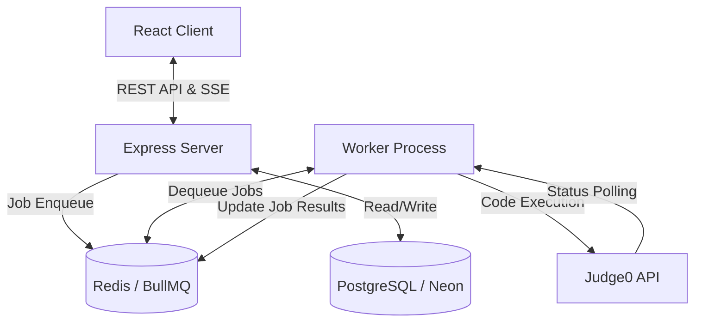
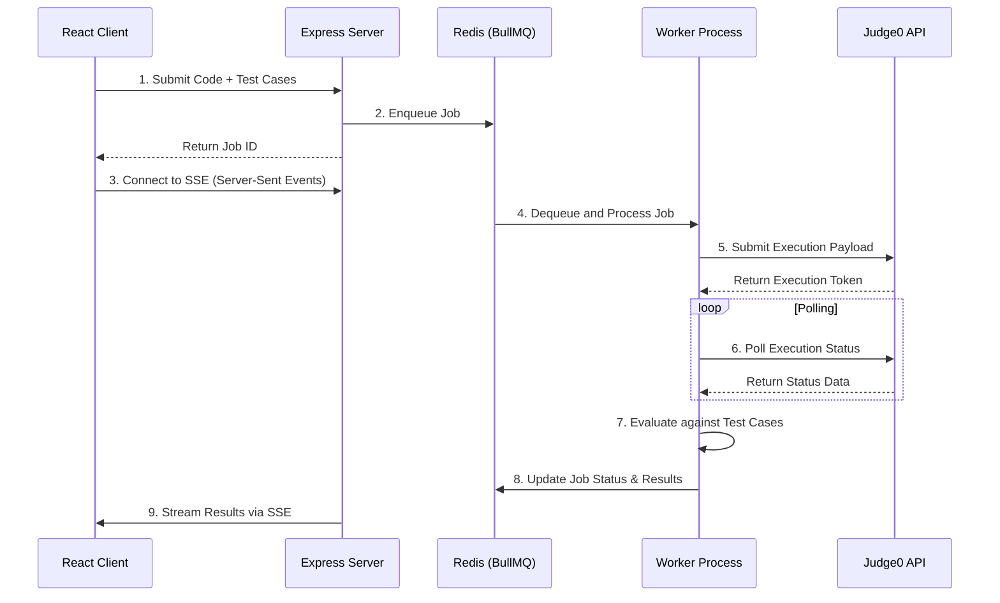

# CodePro - Online Code Execution Engine

CodePro is a high-performance, full-stack online code execution engine and competitive programming platform. It leverages **Judge0** for secure code execution, **BullMQ** + **Redis** for robust background job processing, and **React** for a seamless user experience.

## 🚀 Features

- **Robust Code Execution**: Compiles and runs code securely using the Judge0 API.
- **Asynchronous Processing**: Uses BullMQ and Redis to queue and process code submissions, ensuring the server stays responsive under load.
- **Real-Time Updates**: Provides real-time execution status and results to the client using Server-Sent Events (SSE) or polling.
- **Test Case Evaluation**: Supports sample and hidden test cases, providing immediate feedback on correctness (Accepted, Wrong Answer, Time Limit Exceeded, Runtime Error, etc.).
- **Modern UI/UX**: Built with React, Vite, and Monaco Editor for a rich, IDE-like coding experience in the browser.

## 🛠️ Technology Stack

### System Architecture



### Frontend (Client)
- **Framework**: React 19 + TypeScript + Vite
- **State Management**: Zustand
- **Code Editor**: Monaco Editor (`@monaco-editor/react`)
- **Styling**: Vanilla CSS / modern UI approaches

### Backend (Server)
- **Framework**: Node.js + Express + TypeScript
- **Queue System**: BullMQ + ioredis (Redis)
- **Code Execution**: Judge0 API
- **Database**: PostgreSQL (pg), configured to work with Neon serverless Postgres
- **Architecture**: Modular services including `judge0Service`, `executionService`, and `workerService` for background processing.

### Infrastructure
- **Docker**: Containerized backend and frontend components (`docker-compose.yml` included).

## 📂 Project Structure

```
CodePro/
├── client/                 # React frontend application
│   ├── src/                # Frontend source code (components, store, styles)
│   ├── index.html          # Entry HTML
│   ├── package.json        # Frontend dependencies
│   └── vite.config.ts      # Vite configuration
├── server/                 # Express backend application
│   ├── src/                # Backend source code
│   │   ├── config/         # App configuration & constants
│   │   ├── controllers/    # Route controllers
│   │   ├── services/       # Core logic (Judge0 integration, BullMQ worker)
│   │   ├── routes/         # API routes
│   │   ├── utils/          # Storage, SSE helpers
│   │   ├── index.ts        # Express server entry point
│   │   └── worker.ts       # Standalone worker process for BullMQ
│   ├── package.json        # Backend dependencies
│   └── Dockerfile          # Backend Docker config
├── docker-compose.yml      # Docker compose configuration for local deployment
└── README.md               # This file
```

## ⚙️ How It Works



1. **Submission**: The user writes code in the Monaco Editor and submits it.
2. **Queueing**: The frontend sends the payload to the backend, which enqueues a job in BullMQ (backed by Redis) and returns a unique `jobId`.
3. **Execution**: A background worker (running `server/src/worker.ts`) picks up the job, formats the payload (including test cases), and submits it to the Judge0 API.
4. **Polling Judge0**: The worker polls Judge0 for the execution status. Once complete, it evaluates the stdout against expected outputs (test cases).
5. **Result Delivery**: The job is marked as complete in Redis, and the backend delivers the results to the client via SSE (or polling).

## 🚀 Getting Started

### Prerequisites
- Node.js (v18+)
- Redis (running locally or accessible via URL)
- PostgreSQL (or Neon DB instance)
- Judge0 instance (or public API access)

### 1. Clone the repository
Make sure you are in the project root (`CodePro`).

### 2. Backend Setup
```bash
cd server
npm install
# Create a .env file based on environment requirements (Redis URL, Judge0 URL, DB connection)
npm run dev
# In a separate terminal, start the worker
npm run dev:worker
```

### 3. Frontend Setup
```bash
cd client
npm install
npm run dev
```

### 4. Docker Deployment
You can also run the application using Docker Compose:
```bash
docker-compose up --build
```
This will start the backend (API + Worker) and frontend (served via Nginx) containers.
